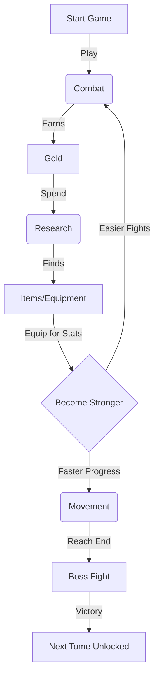

# New Player Guide: Journey into Math et Matik

Welcome, Mathematician! Your journey through the realm of numbers is about to begin. This guide will help you understand how to navigate the world, defeat monsters, and become powerful.

## 1. Getting Started

### The Main Hub
When you enter the game, you are placed in your **Camp (Home Screen)**.
*   **Top Bar**: Shows your current **Quest Progress** or active **Encounter**.
*   **Left Panel (Desktop)** or **Menu (Mobile)**: Displays your Hero's stats (HP, Level, Gold).
*   **Center Menu**: The four magical disciplines you can practice.

---

## 2. The Pillars of Gameplay

Success requires mastering four types of magic (mathematics).

### 🦶 Movement (Addition & Subtraction)
*   **Goal**: Travel distance in your active Tome (Chapter).
*   **How to Play**: Solve a sequence of addition or subtraction problems.
*   **Reward**: XP and Distance.
*   **Why?**: To reach the Boss at the end of the Tome and unlock new worlds.

### ⚔️ Combat (Multiplication)
*   **Goal**: Defeat enemies blocking your path or earn Gold.
*   **How to Play**:
    *   **Normal Enemies**: You have a time limit to answer questions. Correct answers deal damage.
    *   **Bosses**: A timer counts down continuously! Answer correctly to fill your **Action Gauge**. When full, you attack automatically.
*   **Reward**: XP and **Gold**.
*   **Why?**: You need Gold to buy research items and upgrade companions.

### 🔍 Research (Division)
*   **Goal**: Unlock magical chests to find equipment.
*   **How to Play**:
    1.  Spend **Gold** to enter.
    2.  Select a Chest (Rarity depends on luck).
    3.  Solve a division puzzle to break the lock.
*   **Reward**: **Items** (Equipment).
*   **Why?**: Items make you stronger (more HP, Attack, or Gold gain).

### 🧪 Alchemy (Fractions)
*   **Goal**: Craft consumable potions.
*   **How to Play**: Spend **Nems** (obtained by melting unwanted items) to draft a recipe, then solve fraction problems to brew it.
*   **Reward**: Potions (Healing, Buffs).

---

## 3. The Core Loop (How to Win)

---

## 4. Character Growth

### Stats
*   **❤️ HP**: Health Points. If this reaches 0, you lose the battle. Increases with Level.
*   **⚔️ Attack**: How much damage you deal to monsters. Increases with Level and Items.
*   **🛡️ Defense**: Reduces damage taken. Increases every 4 Levels.
*   **🦶 Agility**: Bonus movement speed. Increases every 3 Levels.

### Equipment & Inventory
1.  Click the **"Backpack"** icon (bottom left) or the **"Details"** button on your stat widget.
2.  Drag and drop items from your **Backpack** into the numbered **Active Slots**.
    *   *Note*: Slots 4, 5, and 6 are locked until you reach levels 5, 10, and 15!
3.  Different items give different bonuses (e.g., "Scholar" items give more XP, "Fighter" items give more Attack).

### Companions
You are not alone!
1.  Click the **"Companions"** icon (bottom left or in profile).
2.  **Select** a companion to aid you. They provide passive bonuses (e.g., *Fib the Thief* grants extra gold).
3.  **Level Up**: Use your Gold to train your companion. Higher levels mean stronger bonuses!
    *   Level 2: 150g
    *   Level 3: 450g
    *   Level 4: 1,200g
    *   Level 5: 3,000g

---

## 5. Tips for Survival
*   **Stuck on a Boss?** Go back to previous levels to grind Combat for Gold. Use that Gold to find better items in Research.
*   **Need Healing?** Leveling up fully restores your HP.
*   **Too many items?** Visit the **Black Mirror** (top right of Inventory) to melt common items into Nems for Alchemy.
