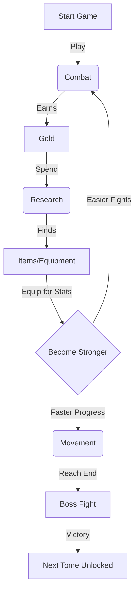

# New Player Guide: Journey into Math et Matik

Welcome, Mathematician! Your journey through the realm of numbers is about to begin. This guide will help you understand how to navigate the world, defeat monsters, and become powerful.

## 1. Getting Started

### The Main Hub
When you enter the game, you are placed in your **Camp (Home Screen)**.
*   **Top Bar**: Shows your current **Quest Progress** or active **Encounter**.
*   **Stats Panel**: Displays your Hero's vital statistics (HP, Level, Gold).
*   **Center Menu**: The four magical disciplines you can practice.

### Customizing Your Experience
Visit the **Options** menu (Gear icon) to tailor the game:
*   **Vertical Math**: Toggle this to stack numbers vertically (e.g., $\begin{smallmatrix} 5 \\ +3 \end{smallmatrix}$) instead of horizontally ($5 + 3$).
*   **Language**: Switch between English and French at any time.

---

## 2. The Pillars of Gameplay

Success requires mastering four types of magic (mathematics).

### 🦶 Movement (Addition & Subtraction)
*   **Goal**: Travel distance in your active Tome (Chapter).
*   **How to Play**: Solve a sequence of addition or subtraction problems.
*   **Reward**: XP and Distance.
*   **Why?**: To reach the Boss at the end of the Tome and unlock new worlds.

### ⚔️ Combat (Multiplication)
*   **Goal**: Defeat enemies blocking your path or earn Gold.
*   **Normal Enemies**: 
    *   You have a time limit to answer questions. 
    *   **Speed Bonus**: Answering quickly (while the timer is Gold or Green) deals extra damage!
*   **Bosses**: 
    *   A timer counts down continuously. If it hits 0, you take damage!
    *   **Operator Mode**: Some bosses hide the operator (e.g., `2 ? 2 = 4`). Use the **Colored Keypad** to pick the right symbol (+, -, ×, ÷).
    *   Correct answers fill your **Action Gauge**. When full, you attack automatically.
*   **Reward**: XP and **Gold**.

### 🔍 Research (Division)
*   **Goal**: Unlock magical chests to find equipment.
*   **How to Play**:
    1.  Spend **Gold** to enter.
    2.  Select a Chest (Rarity depends on luck).
    3.  Solve a division puzzle to break the lock.
*   **Reward**: **Items** (Equipment).
*   **Why?**: Items make you stronger (more HP, Attack, or Gold gain).

### 🧪 Alchemy (Fractions)
*   **Goal**: Craft consumable potions.
*   **How to Play**: 
    1.  Spend **Nems** (Purple Currency) to draft a recipe.
    2.  Solve fraction problems to stabilize the mixture.
*   **Reward**: Potions (Healing, Buffs).
*   **Warning**: Wrong answers can shatter the flask!

---

## 3. The Core Loop (How to Win)

---

## 4. Character Growth

### Stats
*   **❤️ HP**: Health Points. If this reaches 0, you lose the battle. Increases with Level. **Leveling up fully restores your HP.**
*   **⚔️ Attack**: How much damage you deal to monsters. Increases with Level and Items.
*   **🛡️ Defense**: Reduces damage taken. Increases every 4 Levels.
*   **🦶 Agility**: Bonus movement speed. Increases every 3 Levels.

### Equipment & Inventory
1.  Click the **"Inventory"** icon (Backpack).
2.  **Drag and Drop** items from your storage into the numbered **Active Slots**.
    *   *Mobile Users*: Tap an item to select it, then tap a slot to place it.
    *   *Note*: Slots 4, 5, and 6 are locked until you reach levels 5, 10, and 15!
3.  **Active Bonuses**: Check the summary panel below your slots to see your total magical boosts (e.g., +20% Gold).

### Companions
You are not alone!
1.  Click the **"Companions"** icon.
2.  **Select** a companion to aid you. They provide passive bonuses (e.g., *Fib the Thief* grants extra gold).
3.  **Level Up**: Use your Gold to train your companion. Higher levels mean stronger bonuses!

---

## 5. Advanced Mechanics

### The Black Mirror (Melting)
Have too many common items?
1.  Open your **Inventory**.
2.  Click the **"Black Mirror"** button (next to the title).
3.  Select items to sacrifice.
4.  **Melt** them to receive **Nems** ($\Sigma$).
5.  Use Nems in **Alchemy** to craft powerful potions.

### Boss Strategy
*   **Hidden Operators**: Look closely at the numbers. `4 ? 2 = 2` could be Subtraction (-) or Division (÷). The buttons are color-coded to help you react faster.
*   **Panic**: If the timer is running low, focus! A wrong answer reduces your timer even further.
