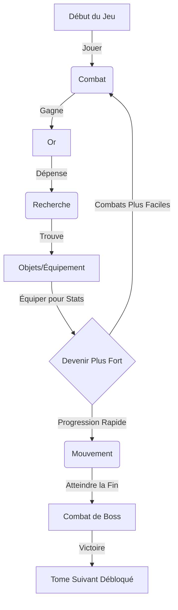

# Guide du Nouveau Joueur : Voyage dans Math et Matik

Bienvenue, Mathématicien ! Votre voyage à travers le royaume des nombres est sur le point de commencer. Ce guide vous aidera à comprendre comment naviguer dans ce monde, vaincre des monstres et devenir puissant.

## 1. Pour Commencer

### Le Camp Principal (Accueil)
Lorsque vous entrez dans le jeu, vous vous trouvez dans votre **Camp**.
*   **Barre Supérieure** : Affiche votre **Progression de Quête** ou la **Rencontre** active.
*   **Panneau de Stats** : Affiche les statistiques vitales de votre Héros (PV, Niveau, Or).
*   **Menu Central** : Les quatre disciplines magiques que vous pouvez pratiquer.

### Personnaliser votre Expérience
Visitez le menu **Options** (icône Engrenage) pour régler le jeu :
*   **Maths Verticales** : Activez ceci pour empiler les nombres verticalement (ex : $\begin{smallmatrix} 5 \\ +3 \end{smallmatrix}$) au lieu d'horizontalement ($5 + 3$).
*   **Langue** : Basculez entre l'anglais et le français à tout moment.

---

## 2. Les Piliers du Jeu

Le succès exige la maîtrise de quatre types de magie (mathématiques).

### 🦶 Mouvement (Addition & Soustraction)
*   **But** : Parcourir de la distance dans votre Tome (Chapitre) actif.
*   **Comment jouer** : Résolvez une séquence d'additions ou de soustractions.
*   **Récompense** : XP et Distance.
*   **Pourquoi ?** : Pour atteindre le Boss à la fin du Tome et débloquer de nouveaux mondes.

### ⚔️ Combat (Multiplication)
*   **But** : Vaincre les ennemis ou gagner de l'Or.
*   **Ennemis Normaux** : 
    *   Vous avez un temps limité. 
    *   **Bonus de Vitesse** : Répondre rapidement (quand le timer est Or ou Vert) inflige des dégâts supplémentaires !
*   **Boss** : 
    *   Un chronomètre tourne en continu. S'il atteint 0, vous subissez des dégâts !
    *   **Mode Opérateur** : Certains boss cachent l'opérateur (ex : `2 ? 2 = 4`). Utilisez le **Clavier Coloré** pour choisir le bon symbole (+, -, ×, ÷).
    *   Les bonnes réponses remplissent votre **Jauge d'Action**. Une fois pleine, vous attaquez automatiquement.
*   **Récompense** : XP et **Or**.

### 🔍 Recherche (Division)
*   **But** : Déverrouiller des coffres magiques pour trouver de l'équipement.
*   **Comment jouer** :
    1.  Dépensez de l'**Or** pour entrer.
    2.  Sélectionnez un Coffre (la Rareté dépend de la chance).
    3.  Résolvez une énigme de division pour briser la serrure.
*   **Récompense** : **Objets** (Équipement).
*   **Pourquoi ?** : Les objets vous rendent plus fort (plus de PV, d'Attaque ou de gain d'Or).

### 🧪 Alchimie (Fractions)
*   **But** : Fabriquer des potions consommables.
*   **Comment jouer** : 
    1. Dépensez des **Nems** (Monnaie Violette) pour choisir une recette.
    2. Résolvez des problèmes de fractions pour stabiliser le mélange.
*   **Récompense** : Potions (Soins, Bonus).
*   **Attention** : Une mauvaise réponse peut briser la fiole !

---

## 3. La Boucle de Jeu (Comment Gagner)

---

## 4. Croissance du Personnage

### Statistiques
*   **❤️ PV (Points de Vie)** : Si cela atteint 0, vous perdez la bataille. Augmente avec le Niveau. **Monter de niveau restaure entièrement vos PV.**
*   **⚔️ Attaque** : Les dégâts que vous infligez aux monstres. Augmente avec le Niveau et les Objets.
*   **🛡️ Défense** : Réduit les dégâts reçus. Augmente tous les 4 Niveaux.
*   **🦶 Agilité** : Vitesse de déplacement bonus. Augmente tous les 3 Niveaux.

### Équipement & Inventaire
1.  Cliquez sur l'icône **"Inventaire"** (Sac à Dos).
2.  **Glissez et Déposez** des objets vers les **Emplacements Actifs** numérotés.
    *   *Sur Mobile* : Appuyez sur un objet pour le sélectionner, puis sur un emplacement pour le placer.
    *   *Note* : Les emplacements 4, 5 et 6 sont verrouillés jusqu'aux niveaux 5, 10 et 15 !
3.  **Bonus Actifs** : Vérifiez le panneau de résumé sous vos emplacements pour voir vos boosts totaux (ex : +20% Or).

### Compagnons
Vous n'êtes pas seul !
1.  Cliquez sur l'icône **"Compagnons"**.
2.  **Sélectionnez** un compagnon pour vous aider. Ils offrent des bonus passifs (par ex. *Fib le Voleur* donne plus d'or).
3.  **Niveau Supérieur** : Utilisez votre Or pour entraîner votre compagnon. Des niveaux plus élevés signifient des bonus plus puissants !

---

## 5. Mécaniques Avancées

### Le Miroir Noir (Fusion)
Trop d'objets communs ?
1.  Ouvrez votre **Inventaire**.
2.  Cliquez sur le bouton **"Miroir Noir"** (à côté du titre).
3.  Sélectionnez les objets à sacrifier.
4.  **Fondez-les** pour recevoir des **Nems** ($\Sigma$).
5.  Utilisez les Nems en **Alchimie** pour créer des potions puissantes.

### Stratégie de Boss
*   **Opérateurs Cachés** : Regardez bien les chiffres. `4 ? 2 = 2` pourrait être une Soustraction (-) ou une Division (÷). Les boutons sont colorés pour vous aider à réagir plus vite.
*   **Panique** : Si le chronomètre est bas, concentrez-vous ! Une mauvaise réponse réduit encore plus votre temps.
