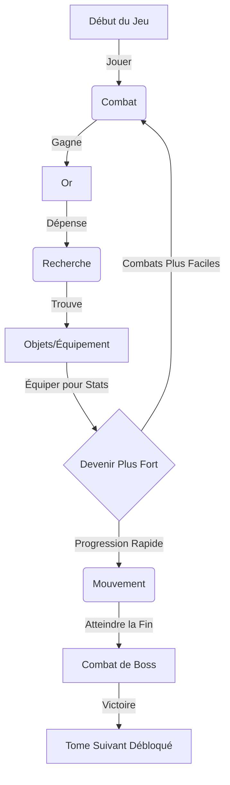

# Guide du Nouveau Joueur : Voyage dans Math et Matik

Bienvenue, Mathématicien ! Votre voyage à travers le royaume des nombres est sur le point de commencer. Ce guide vous aidera à comprendre comment naviguer dans ce monde, vaincre des monstres et devenir puissant.

## 1. Pour Commencer

### Le Camp Principal (Accueil)
Lorsque vous entrez dans le jeu, vous vous trouvez dans votre **Camp**.
*   **Barre Supérieure** : Affiche votre **Progression de Quête** ou la **Rencontre** active.
*   **Panneau de Gauche (Bureau) / Menu (Mobile)** : Affiche les statistiques de votre Héros (PV, Niveau, Or).
*   **Menu Central** : Les quatre disciplines magiques que vous pouvez pratiquer.

---

## 2. Les Piliers du Jeu

Le succès exige la maîtrise de quatre types de magie (mathématiques).

### 🦶 Mouvement (Addition & Soustraction)
*   **But** : Parcourir de la distance dans votre Tome (Chapitre) actif.
*   **Comment jouer** : Résolvez une séquence d'additions ou de soustractions.
*   **Récompense** : XP et Distance.
*   **Pourquoi ?** : Pour atteindre le Boss à la fin du Tome et débloquer de nouveaux mondes.

### ⚔️ Combat (Multiplication)
*   **But** : Vaincre les ennemis qui bloquent votre chemin ou gagner de l'Or.
*   **Comment jouer** :
    *   **Ennemis Normaux** : Vous avez un temps limité pour répondre. Les bonnes réponses infligent des dégâts.
    *   **Boss** : Un chronomètre tourne en continu ! Répondez correctement pour remplir votre **Jauge d'Action**. Une fois pleine, vous attaquez automatiquement.
*   **Récompense** : XP et **Or**.
*   **Pourquoi ?** : Vous avez besoin d'Or pour acheter des objets de recherche et améliorer vos compagnons.

### 🔍 Recherche (Division)
*   **But** : Déverrouiller des coffres magiques pour trouver de l'équipement.
*   **Comment jouer** :
    1.  Dépensez de l'**Or** pour entrer.
    2.  Sélectionnez un Coffre (la Rareté dépend de la chance).
    3.  Résolvez une énigme de division pour briser la serrure.
*   **Récompense** : **Objets** (Équipement).
*   **Pourquoi ?** : Les objets vous rendent plus fort (plus de PV, d'Attaque ou de gain d'Or).

### 🧪 Alchimie (Fractions)
*   **But** : Fabriquer des potions consommables.
*   **Comment jouer** : Dépensez des **Nems** (obtenus en fondant des objets) pour choisir une recette, puis résolvez des problèmes de fractions.
*   **Récompense** : Potions (Soins, Bonus).

---

## 3. La Boucle de Jeu (Comment Gagner)

---

## 4. Croissance du Personnage

### Statistiques
*   **❤️ PV (Points de Vie)** : Si cela atteint 0, vous perdez la bataille. Augmente avec le Niveau.
*   **⚔️ Attaque** : Les dégâts que vous infligez aux monstres. Augmente avec le Niveau et les Objets.
*   **🛡️ Défense** : Réduit les dégâts reçus. Augmente tous les 4 Niveaux.
*   **🦶 Agilité** : Vitesse de déplacement bonus. Augmente tous les 3 Niveaux.

### Équipement & Inventaire
1.  Cliquez sur l'icône **"Sac à Dos"** (en bas à gauche) ou sur le bouton **"Détails"** de votre widget de statistiques.
2.  Glissez et déposez des objets de votre **Sac à Dos** vers les **Emplacements Actifs** numérotés.
    *   *Note* : Les emplacements 4, 5 et 6 sont verrouillés jusqu'à ce que vous atteigniez les niveaux 5, 10 et 15 !
3.  Différents objets donnent différents bonus (par ex. les objets "Érudit" donnent plus d'XP, les objets "Combattant" donnent plus d'Attaque).

### Compagnons
Vous n'êtes pas seul !
1.  Cliquez sur l'icône **"Compagnons"** (en bas à gauche ou dans le profil).
2.  **Sélectionnez** un compagnon pour vous aider. Ils offrent des bonus passifs (par ex. *Fib le Voleur* donne plus d'or).
3.  **Niveau Supérieur** : Utilisez votre Or pour entraîner votre compagnon. Des niveaux plus élevés signifient des bonus plus puissants !
    *   Niveau 2 : 150g
    *   Niveau 3 : 450g
    *   Niveau 4 : 1,200g
    *   Niveau 5 : 3,000g

---

## 5. Conseils de Survie
*   **Bloqué sur un Boss ?** Retournez dans les niveaux précédents pour faire du Combat et gagner de l'Or. Utilisez cet Or pour trouver de meilleurs objets via la Recherche.
*   **Besoin de Soins ?** Monter de niveau restaure entièrement vos PV.
*   **Trop d'objets ?** Visitez le **Miroir Noir** (en haut à droite de l'inventaire) pour fondre les objets en Nems pour l'Alchimie.
